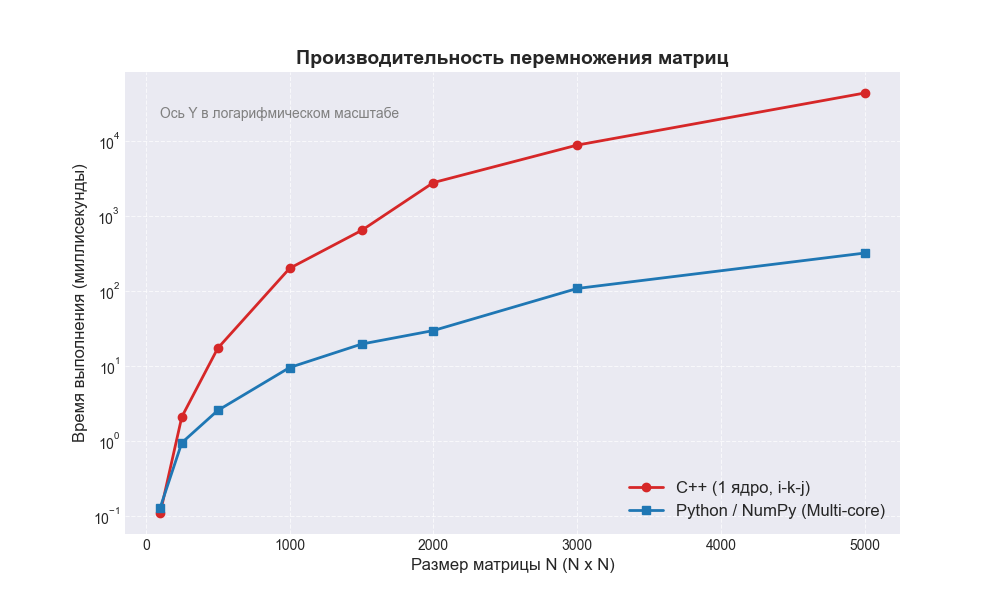

# Лабораторная работа №1

## Задание
*    Написать программу на языке C/C++ для перемножения двух квадратных матриц.
*    Исходные данные: файл(ы) содержащие значения исходных матриц.
*    Выходные данные: файл со значениями результирующей матрицы, время выполнения, объем задачи.
*    Обязательна автоматизированная верификация результатов вычислений с помощью сторонних библиотек или стороннего ПО (например на Matlab/Python).


# Оптимизация перемножения матриц: C++ vs NumPy

Данный проект посвящен исследованию производительности алгоритмов перемножения плотных квадратных матриц. Основной акцент сделан на реализации эффективного обхода памяти в C++ и сравнении полученных результатов с индустриальным стандартом в лице библиотеки NumPy.

## 🧠 Алгоритмические особенности

В проекте реализован алгоритм с перестановкой циклов **i-k-j**. В отличие от подхода (i-j-k), данный метод оптимизирует использование иерархии кэш-памяти процессора. 

(нашел интересную статью на хабре: https://habr.com/ru/articles/359272/ , но от туда по сути только первый способ применил)


### Преимущества порядка i-k-j:
*   **Локальность данных:** Внутренний цикл обращается к элементам матриц последовательно, что минимизирует количество промахов кэша (Cache Misses).
*   **Hardware Prefetching:** Линейный доступ к памяти позволяет процессору эффективно предугадывать и загружать данные в кэш L1/L2 до того, как они потребуются алгоритму.
*   **Векторизация:** Последовательный доступ упрощает компилятору задачу автоматической генерации SIMD-инструкций (AVX/AVX2).

```cpp
// Реализованная схема (i-k-j)
for (int i = 0; i < N; ++i) {
    for (int k = 0; k < N; ++k) {
        double temp = A[i * N + k];
        for (int j = 0; j < N; ++j) {
            C[i * N + j] += temp * B[k * N + j];
        }
    }
}
```

---

## 📊 Результаты тестирования

Сравнение времени выполнения однопоточной реализации на C++ и многопоточной библиотеки NumPy. 

| Размер матрицы ($N \times N$) | Время C++ (1 ядро) | Время NumPy (Multi-core) |
| :--- | :--- | :--- |
| **100 x 100** | 0.11 мс | 0.13 мс |
| **250 x 250** | 2.10 мс | 0.95 мс |
| **500 x 500** | 17.27 мс | 2.56 мс |
| **1000 x 1000** | 200.93 мс | 9.56 мс |
| **1500 x 1500** | 641.72 мс | 19.63 мс |
| **2000 x 2000** | 2790.73 мс | 29.75 мс |
| **3000 x 3000** | 8819.36 мс | 108.24 мс |
| **5000 x 5000** | 43630.70 мс | 321.02 мс |

---

## 🔬 Анализ производительности

1.  **Эффективность кэширования:** На малых и средних размерностях (до $1000 \times 1000$) C++ демонстрирует высокую удельную производительность благодаря тому, что рабочие наборы данных эффективно размещаются в кэш-памяти третьего уровня (L3), как только перестают влезать - затраченное время начинает значительно увеличиваться. 
2.  **Масштабируемость:** При увеличении $N$ время выполнения растет в соответствии с теоретической сложностью $O(N^3)$. Как я понял из-за того что NumPy на все ядрах сразу считает.
3.  **Предел однопотока:** Оптимизированная реализация на C++ позволяет достичь высокой пропускной способности (GFLOPS) на одном ядре, что является потолком для алгоритмов без использования специфических низкоуровневых инструкций или внешних библиотек. (иначе часами считать может)

---

## ✅ Верификация и контроль точности

Для обеспечения корректности вычислений в проекте реализована система автоматической валидации на базе Python:

*   **Эталонное сравнение (Ground Truth):** Результаты работы C++ версии сопоставляются с результатами функции `numpy.dot()`. 
*   **Допуск погрешности:** Сравнение производится с помощью метода `numpy.allclose()` с относительным допуском $rtol=1e-01$. Это нужно для учета особенностей арифметики чисел с плавающей запятой ($IEEE 754$), так как изменение порядка операций (i-k-j вместо i-j-k) может приводить к минимальным различиям в накоплении ошибки округления.
*   **Автоматизация:** При каждом запуске бенчмарка скрипт `verify.py` генерирует новые наборы случайных данных, исключая возможность «подгонки» результата. Вывод программы блокируется, если обнаружено расхождение в результатах, что гарантирует достоверность всех приведенных ниже данных.
