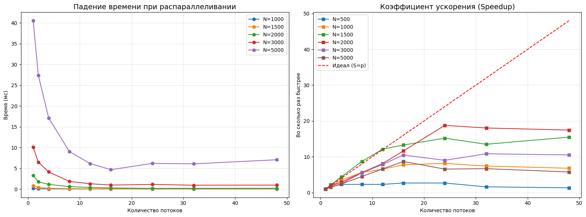

# Лабораторная работа №2: Параллельное умножение матриц с использованием OpenMP

## Описание проекта
Данная работа посвящена модификации последовательного алгоритма умножения матриц (из л/р №1) для работы в многопоточном режиме.

Основная цель: изучить влияние количества потоков и размера данных на ускорение и эффективность программы.

## Технологический стек
* **Язык:** C++ (стандарт C++17)
* **Параллелизм:** OpenMP
* **Анализ данных:** Python (Pandas, Matplotlib)
* **Компилятор:** GCC (с флагами `-O3 -fopenmp`)

## Инструкция по запуску

1. **Компиляция C++ кода:** 

    *не обязательно, это делает python-скрипт

   ```bash
   g++ -O3 -fopenmp main.cpp -o matmul
   ````

2.  **Запуск автоматизированных тестов (Python):**
    ```bash
    python statistics_harvester.py
    ```
    Скрипт поочередно устанавливает переменную окружения `OMP_NUM_THREADS` и запускает вычисления для разных размеров матриц.

## Результаты экспериментов

В ходе работы были проведены замеры для матриц размером от 100x100 до 5000x5000 и количества потоков от 1 до 48. 

*потому что у меня 24 ядра и еще 24 лог. процессоров, решил потестить

---

### Таблица результатов экспериментов

| Размер матрицы ($N$) | Потоки ($P$) | Время ($T$, мс) | Ускорение ($S = T_1 / T_p$) |
| :--- | :--- | :--- | :--- |
| **1000** | 1 | 0.163 | 1.00 |
| | 4 | 0.047 | 3.47 |
| | 8 | 0.029 | 5.62 |
| | 16 | 0.021 | 7.76 |
| | **24** | **0.020** | **8.15** |
| | 48 | 0.024 | 6.79 |
| **2000** | 1 | 3.264 | 1.00 |
| | 4 | 1.131 | 2.89 |
| | 8 | 0.584 | 5.59 |
| | 16 | 0.281 | 11.62 |
| | **24** | **0.174** | **18.76** |
| | 48 | 0.187 | 17.45 |
| **3000** | 1 | 10.088 | 1.00 |
| | 4 | 4.132 | 2.44 |
| | 8 | 1.830 | 5.51 |
| | 16 | 0.963 | 10.48 |
| | **24** | **1.119** | **9.02** |
| | 48 | 0.960 | 10.51 |
| **5000** | 1 | 40.515 | 1.00 |
| | 4 | 17.089 | 2.37 |
| | 8 | 9.013 | 4.50 |
| | 16 | **4.666** | **8.68** |
| | 24 | 6.180 | 6.56 |
| | 48 | 7.053 | 5.74 |

---

### График производительности



### Анализ ускорения (Speedup)

На матрице размера **2000x2000**:

  * Время на 1 потоке: **3.264 сек**
  * Время на 24 потоках: **0.174 сек**
  * **Фактическое ускорение:** \~18.7x (при теоретическом максимуме 24x).

## Выводы

1.  **Эффективность распараллеливания:**
    Создание и синхронизация потоков в OpenMP занимают определенное процессорное время. На малых выборках (N<500) эти затраты превышают пользу от распределения вычислений.

2.  **Влияние архитектуры процессора:**
    Максимальное ускорение достигнуто на 24 потоках, что соответствует количеству физических ядер. Переход к 48 потокам (Hyper-Threading) не дает кратного прироста, так как логические процессоры делят общие исполнительные блоки ядра.

3.  **Эффект «Memory Wall»:**
    На матрицах большого размера (N=5000) наблюдается деградация производительности. Причина — «насыщение» шины памяти. 24 ядра генерируют запросы к RAM быстрее, чем контроллер памяти способен их обрабатывать, создавая простои на уровне CPU.

4.  **Закон Амдала:**
    Эксперименты подтвердили, что ускорение ограничено не только количеством ядер, но и долей последовательных операций (чтение/запись файлов), а также системными задержками.

<!-- end list -->
