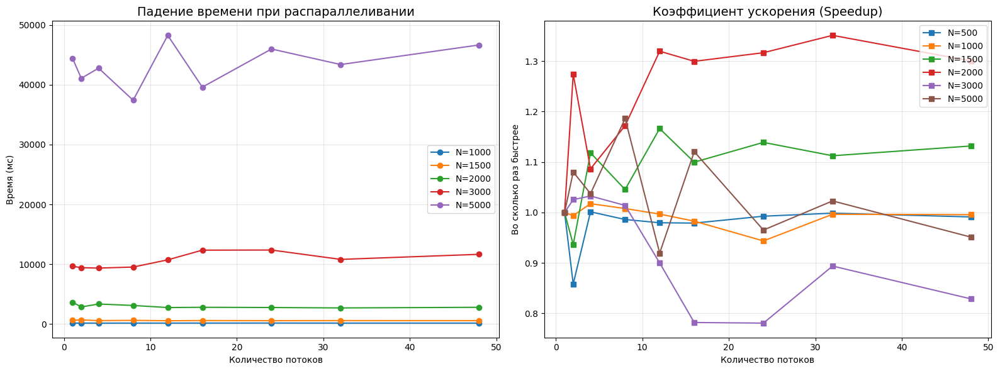

# Отчет по лабораторной работе №3
## Параллельное умножение матриц с использованием технологии MPI

### 1. Цель работы
Модификация последовательной программы умножения матриц для работы в параллельной среде с распределенной памятью (MPI), а также исследование эффективности масштабирования при различных размерах данных и количестве вычислительных узлов.

### 2. Описание алгоритма
Для реализации параллелизма использована схема **декомпозиции по строкам**:
1.  **Процесс-мастер (Rank 0)**:
    * Считывает матрицы $A$ и $B$.
    * Рассчитывает количество строк для каждого процесса (`sendcounts`) и смещения (`displs`), учитывая остаток от деления $N / size$.
    * Рассылает полосы матрицы $A$ через `MPI_Scatterv`.
    * Рассылает матрицу $B$ целиком всем процессам через `MPI_Bcast`.
2.  **Вычислительные процессы (все)**:
    * Принимают свои порции данных.
    * Выполняют локальное умножение в оптимизированном порядке циклов `i-k-j` (cache-friendly).
3.  **Сбор данных**:
    * Результаты (полосы матрицы $C$) собираются на мастере через `MPI_Gatherv`.

### 3. Результаты экспериментов
В таблице ниже приведены замеры времени выполнения (мс) для различных конфигураций. 

| Размер (N) | 1 ядро (мс) | 4 ядра (мс) | 8 ядер (мс) | 12 ядер (мс) | 24 ядра (мс) | 48 ядер (мс) |
| :--- | :--- | :--- | :--- | :--- | :--- | :--- |
| **100** | 0.12 | 0.12 | 0.12 | 0.11 | 0.11 | 0.11 |
| **250** | 2.1287 | 2.1188 | 2.0755 | 2.0407 | 2.1327 | 2.0686 |
| **500** | 16.19 | 16.17 | 16.42 | 16.53 | 16.31 | 16.33 |
| **1000** | 157.60 | 154.89 | 156.38 | 158.09 | 167.01 | 158.28 |
| **2000** | 3639.08 | 3349.35 | 3104.89 | 2757.75 | 2763.96 | 2798.70 |
| **3000** | 9659.15 | 9353.35 | 9525.54 | 10731.40 | 12370.50 | 11653.40 |
| **5000** | 44372.70 | 42772.70 | 37407.30 | 48255.00 | 45972.00 | 46646.30 |

### 4. Графики производительности

> * **График 1**: Зависимость времени от количества ядер (отдельная линия для каждого $N$).
> * **График 2**: Коэффициент ускорения $S(n) = T_1 / T_n$.

### 5. Анализ и выводы

#### Эффективность масштабирования
На основе полученных данных (особенно для $N=5000$) видно, что максимальное ускорение составило около **1.18x** (на 8 ядрах), после чего время выполнения начинает расти. Это значительно ниже теоретически возможного линейного ускорения.

#### Причины низкой эффективности на локальном узле:
1.  **Memory Wall (Стена памяти)**: Умножение матриц является - задача, упирающаяся в память. При увеличении числа параллельных процессов пропускная способность общей шины памяти становится узким местом. Ядра конкурируют за один контроллер памяти, что приводит к простою вычислительных блоков.
2.  **Накладные расходы MPI**: В отличие от OpenMP, MPI работает в изолированных адресных пространствах. Операции `MPI_Bcast` (копирование матрицы в 200 МБ на каждый процесс) и `MPI_Scatterv` создают огромную нагрузку на шину данных и кэш-систему.
3.  **Hyper-Threading**: Результаты на 48 потоках показывают деградацию производительности. Это подтверждает, что логические ядра не эффективны в задачах с плавающей запятой, так как они делят общие FPU-блоки с физическими ядрами.
4.  **Кэш-промахи (Cache Thrashing)**: При $N=5000$ данные не помещаются в L3-кэш. Параллельные процессы вытесняют данные друг друга, увеличивая количество обращений к медленной оперативной памяти.
