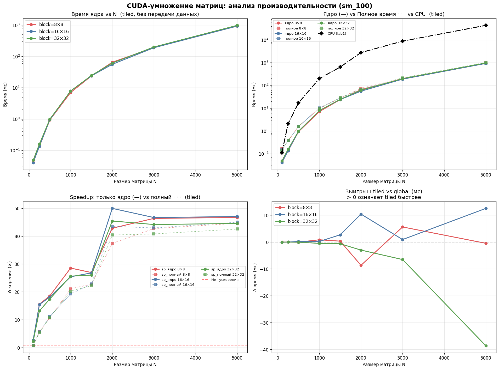

# Лабораторная работа №4 — Параллельное умножение матриц на CUDA

Модификация программы из л/р №1 для параллельной работы по технологии CUDA.  
Исследуется влияние размера матрицы и конфигурации сетки блоков на производительность.

---

## Описание задачи

Реализовать умножение квадратных матриц на GPU с использованием CUDA и сравнить производительность с однопоточной CPU-версией (л/р №1). Эксперименты проводятся при различных размерах матриц и конфигурациях блоков потоков.

---

## Реализация

Реализованы два CUDA-ядра:

- **Global memory** — каждый поток вычисляет одну ячейку результата, читая данные напрямую из глобальной памяти GPU.
- **Shared memory (tiled)** — потоки внутри блока кооперативно загружают фрагменты (тайлы) матриц в быструю разделяемую память (`__shared__`), после чего работают уже с ней.

Для каждого запуска фиксируются два времени:

- **time_kernel_ms** — только вычисление ядра, измеренное через CUDA Events.
- **time_total_ms** — полное время: копирование данных на GPU, вычисление, копирование результата обратно.

---

## Конфигурации экспериментов

| Параметр | Значения |
|---|---|
| Размер матрицы N | 100, 250, 500, 1000, 1500, 2000, 3000, 5000 |
| Размер блока (blockDim) | 8×8, 16×16, 32×32 |
| Режим ядра | global, tiled |
| GPU | NVIDIA (sm_90) |

---

## Запуск

### Требования

- NVIDIA GPU с поддержкой CUDA
- CUDA Toolkit (nvcc)
- Python 3.x: `numpy`, `pandas`, `matplotlib`

### Компиляция и запуск вручную

```bash
nvcc -O3 -std=c++17 -arch=sm_90 main.cu -o matmul_cuda

# Аргументы: <block_size> <tiled: 0|1>
./matmul_cuda 16 1   # block=16×16, tiled (shared memory)
./matmul_cuda 32 0   # block=32×32, global memory
```

Перед запуском в рабочей директории должны находиться файлы `matrixA.txt` и `matrixB.txt` в формате:
```
N
a_00 a_01 ... a_0N
...
```

Результат записывается в `matrixC.txt`.

### Автоматический сбор статистики

Скрипт автоматически генерирует матрицы, перебирает все конфигурации и сохраняет результаты в `results.csv`:

```bash
python statistics_harvester.py
```

Путь к результатам л/р №1 (для расчёта speedup) задаётся в переменной `LAB1_CSV` внутри скрипта.

### Построение графиков

```bash
python graphic_builder.py
```

---

## Результаты

### График производительности



### Фрагмент таблицы результатов

| N | block | mode | kernel (мс) | total (мс) | CPU (мс) | speedup (ядро) | speedup (полный) |
|---|---|---|---|---|---|---|---|
| 100 | 16×16 | global | 0.022 | 0.111 | 0.11 | 4.97× | 0.99× |
| 500 | 8×8 | global | 0.912 | 1.578 | 17.27 | 18.93× | 10.95× |
| 500 | 16×16 | tiled | 0.951 | 1.552 | 17.27 | 18.16× | 11.13× |
| 1000 | 8×8 | tiled | 7.042 | 9.529 | 200.93 | 28.53× | 21.09× |
| 1000 | 32×32 | global | 7.348 | 9.337 | 200.93 | 27.34× | 21.52× |
| 2000 | 8×8 | global | 56.50 | 64.71 | 2790.73 | 49.39× | 43.12× |
| 2000 | 16×16 | tiled | 55.87 | 64.13 | 2790.73 | 49.95× | 43.52× |
| 3000 | 16×16 | tiled | 189.01 | 205.45 | 8819.36 | 46.66× | 42.93× |
| 5000 | 16×16 | tiled | 927.86 | 969.94 | 43630.70 | 47.02× | 44.98× |
| 5000 | 32×32 | global | 940.91 | 980.86 | 43630.70 | 46.37× | 44.48× |

---

## Анализ результатов

**Производительность ядра растёт вместе с N.** На малых матрицах (N=100) накладные расходы на запуск ядра и инициализацию сравнимы с самим вычислением, поэтому GPU не даёт выигрыша по полному времени. Начиная с N≈500 GPU уже значительно быстрее CPU, а при N=5000 полное время работы GPU в ~45 раз меньше.

**Разница между global и tiled минимальна.** При данной архитектуре GPU оба режима показывают близкие результаты — современный GPU имеет большой L2-кэш, который компенсирует лишние обращения к глобальной памяти в global-режиме. Незначительный выигрыш tiled заметен на средних размерах матриц (N=1000–2000), где разница достигает нескольких миллисекунд.

**Размер блока практически не влияет на итоговое время.** Все три конфигурации (8×8, 16×16, 32×32) показывают схожие результаты. Это связано с тем, что GPU загружен равномерно при любом делении задачи на блоки такого диапазона.

**Передача данных — значимая часть полного времени.** На N=500 передача данных по PCIe занимает около 40% от полного времени. С ростом N её доля снижается: при N=5000 она составляет лишь ~5%, и доминирует именно вычисление.
